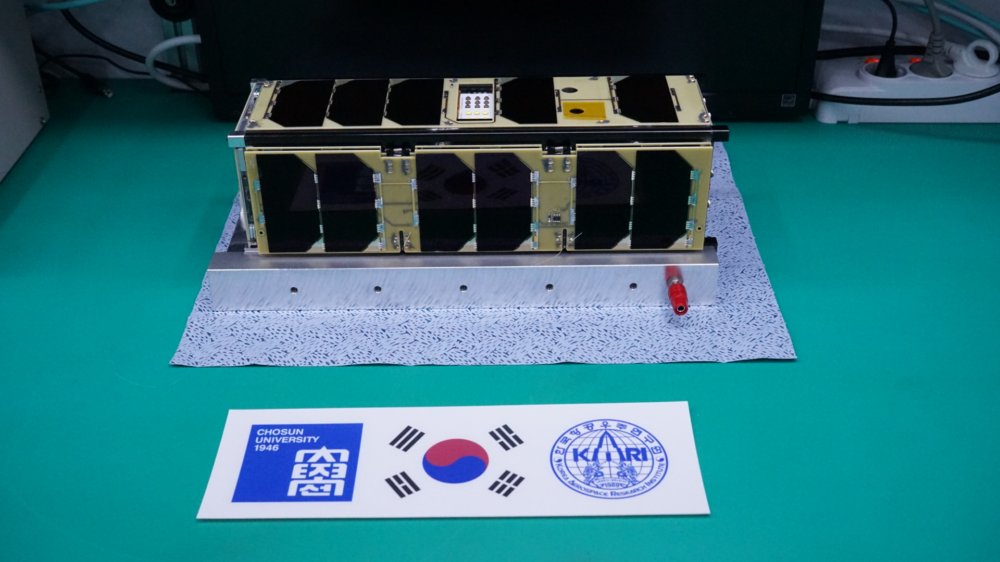
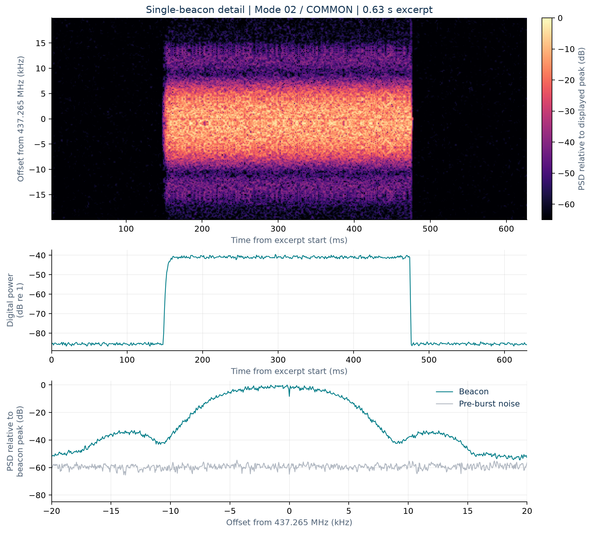
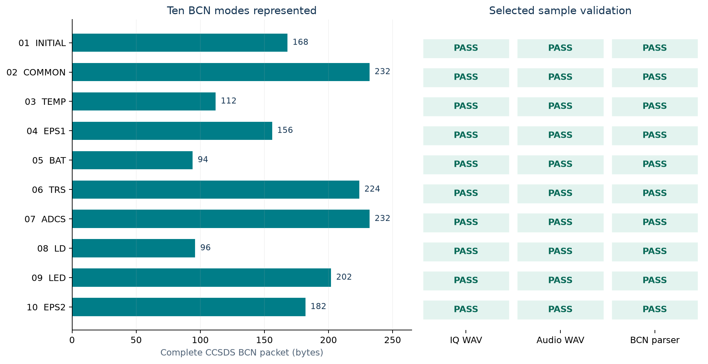
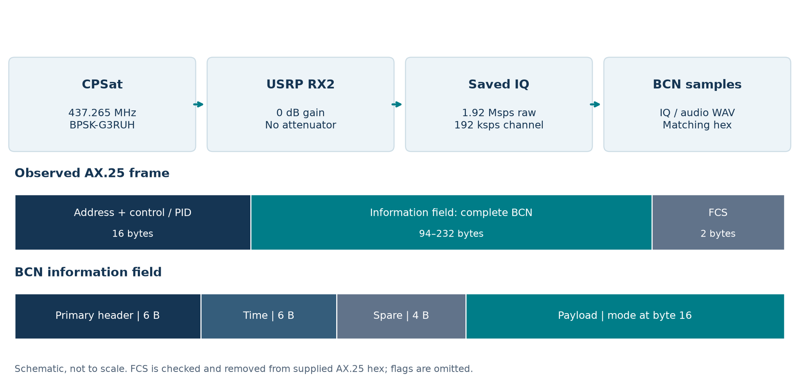
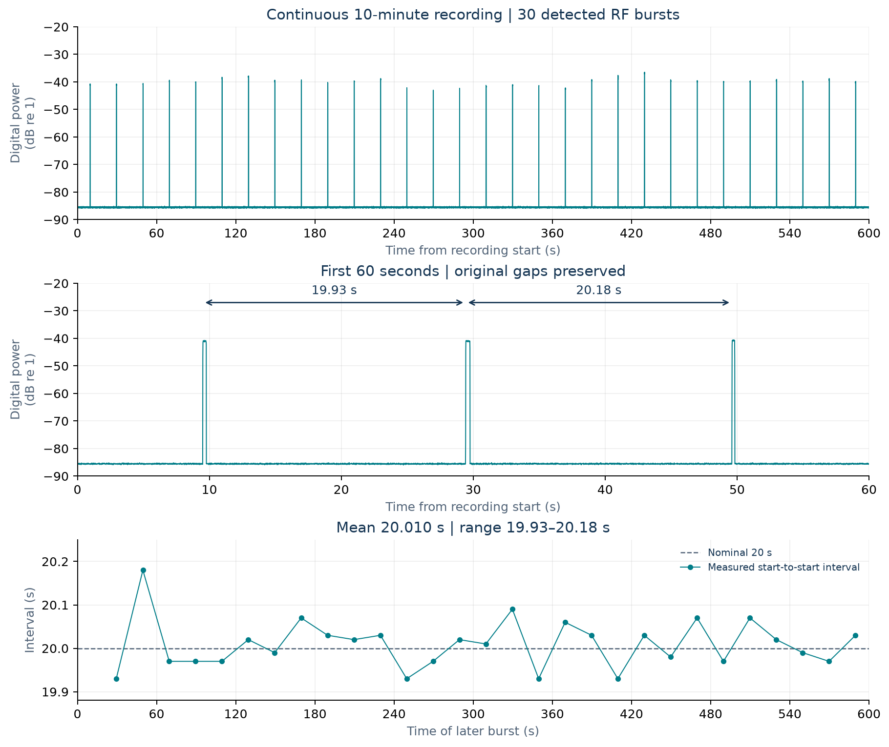
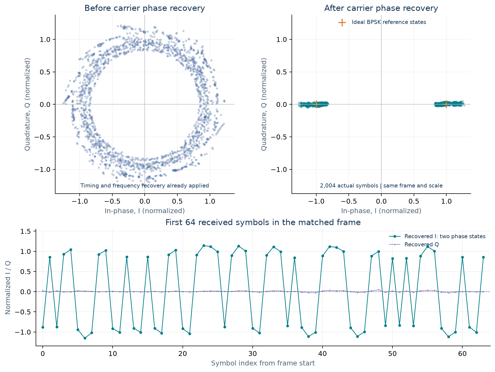

# CPSat BCN recording samples

**Chosun University | Cosmic Lighthouse Keeper Mission**

[Illustrated PDF](CPSat_BCN_Report.pdf) · [Web report](index.html)

[BCN decoder and usage](decoder/README.md) · [Kaitai source](decoder/cpsat.ksy) · [Field definitions](decoder/FIELDS.md) · [Validation results](decoder/validation.json)

The BCN decoder supports modes 1–10 and includes a standalone Python implementation and a Kaitai candidate tested with the SatNOGS field extraction API. It has not yet been submitted to or deployed by SatNOGS. The decoder documentation records the non-ASCII payload call-sign bytes found in the mode 06 sample.

Ten beacon examples recorded during pre-launch indoor over-the-air ground tests of CPSat. These are not in-orbit observations. BCN modes 1 through 10 are included; no HK or command definitions are included.

## Radio and framing

- Nominal downlink: 437.265 MHz, BPSK-G3RUH, 9,600 bit/s, nominal 20-second beacon interval.
- Receiver: NI USRP-2900, RX2, receive gain 0 dB. The external attenuator was removed (0 dB).
- AX.25 destination/source: CPSAT1-0 / CPSAT1-0. Observed address/control/PID bytes: `86 a0 a6 82 a8 62 e0 86 a0 a6 82 a8 62 61 03 f0`.
- `ax25_no_fcs.hex`: complete AX.25 frame after bit destuffing and FCS verification. FCS and HDLC flags are omitted, as in gr-satellites output. One frame per line.
- `bcn_ccsds.hex`: AX.25 information field only. Each sample contains one complete BCN CCSDS packet, MID 0x0903, with the original 16-byte header retained. The mode is at zero-based byte offset 16. No fragmentation was needed for these examples.
- Packet lengths for modes 1–10: 168, 232, 112, 156, 94, 224, 232, 96, 202, 182 bytes. CCSDS packet-length field + 7 equals total packet bytes.
- The spacecraft time fields are preserved as raw values; their epoch has not been confirmed.

## WAV files and processing

Each mode directory contains two representations of the same individually selected beacon and its matching hex:

- `iq_192k.wav`: 192,000 samples/s, stereo signed PCM16, left=I, right=Q. Complex baseband BPSK.
- `audio_48k.wav`: 48,000 samples/s, mono signed PCM16, real passband BPSK centered approximately at +12 kHz. This is not an FM discriminator recording.

Raw reception used 1.92 Msamples/s IQ with hardware tuning 100 kHz above nominal, followed by digital translation and decimation to 192 ksamples/s. Short real-signal excerpts include leading/trailing noise. Each excerpt is amplitude-scaled to preserve PCM precision; scale factors are recorded in `manifest.json`. The measured carrier offset was approximately -870 Hz. A documented +870 Hz digital correction was applied to the selected samples except mode 4, which retains the original offset. Original full-band recordings are preserved separately.

The mono waveform uses a 9 kHz complex low-pass filter (2.5 kHz transition), decimation to 48 ksamples/s, mixing to +12 kHz, and taking the real component. These WAVs are derived from received RF samples; they are not synthesized from the decoded hex.

## Validation

Every selected original complex excerpt, its IQ WAV, and its audio WAV independently produced one CRC-valid BCN frame with the same complete AX.25 frame SHA-256. All ten CCSDS packets also passed the existing BCN definition parser. File checksums, frame checksums, lengths, sample counts and preprocessing factors are in `manifest.json`.

Receiver path: BPSK without Manchester or differential demodulation; NRZI decode, G3RUH descrambler (mask 0x21, seed 0, length 16), HDLC/FCS verification. The tested GNU Radio path used 96 ksamples/s for IQ demodulation, 48 ksamples/s after extracting the +12 kHz audio carrier, FLL bandwidth 100 Hz, Costas bandwidth 50 Hz, clock relative bandwidth 0.06, and RRC alpha 0.35. Receiver state was reset for each sample. The BPSK demodulator supplies its own RMS AGC.

Prepared for SatNOGS maintainer review; inclusion here does not imply SatNOGS decoder integration or approval.

## Illustrated report

Open [the illustrated PDF](CPSat_BCN_Report.pdf) or [the browser report](report.html).

Team-supplied project photograph; not the RF test setup.

Actual received mode 02 IQ, with documented sample gain and frequency correction reversed for plotting. Digital levels are not calibrated dBm.

One verified example per mode; not a packet reception rate.

The diagram is schematic and not to scale. See the PDF for full captions and limitations.

## Hex and byte boundaries

[BCN hex guide](HEX_LAYOUT.md) explains the exact AX.25 and CCSDS boundaries. Each mode directory contains a README with the full received hex, inclusive byte ranges and header values; the illustrated PDF includes all ten annotated dumps.

## Continuous reception and beacon interval

Figure 1. Continuous 600-second reception, including the original intervals without a beacon. Power is averaged over consecutive 10 ms windows of the original 192 ksamples/s complex channel; no amplitude normalization is applied. A threshold 20 dB above median recording power detects 30 RF bursts and 29 start-to-start intervals. Thresholds of 15 and 25 dB also give 30 bursts. Times lie on a 10 ms detection grid. These are energy detections, not counts of decoded packets or exact transmitter scheduling timestamps.

Measured mean interval: 20.010 s; range 19.93–20.18 s. The existing waterfall/spectrum figure is a single 0.63-second beacon excerpt and does not show repetition.

[Continuous power CSV](data/continuous_power.csv) · [Detected burst timing CSV](data/burst_timing.csv) · [Analysis metadata](data/timeline_summary.json)

## BPSK symbol recovery and decoded BCN

Figure 2. Actual mode 02 symbols before and after the order-2 Costas carrier phase recovery loop. Each point is one symbol. Both views use the same 2,004 symbols of the complete matched, HDLC-stuffed frame including FCS, with one shared RMS amplitude scale. No additional phase rotation or point removal is applied. Silence and preamble are outside this frame selection. The source WAV already includes its documented +870 Hz correction; timing and frequency recovery precede the left-hand trace.

The two clusters after recovery show that the receiver separates the two BPSK phase states. The lower trace makes their alternating signs visible. Those signs are channel symbols; NRZI decoding and G3RUH descrambling are still required before interpreting AX.25 bits. The resulting frame passes FCS and matches the published hex byte for byte. This is one successfully decoded example, not a BER, calibrated EVM, reception-rate or sensitivity measurement.

[Symbol CSV](data/recovered_symbols.csv) · [Analysis settings and exact frame hash](data/symbol_analysis.json) · [Decoded BCN](mode_02/README.md)
